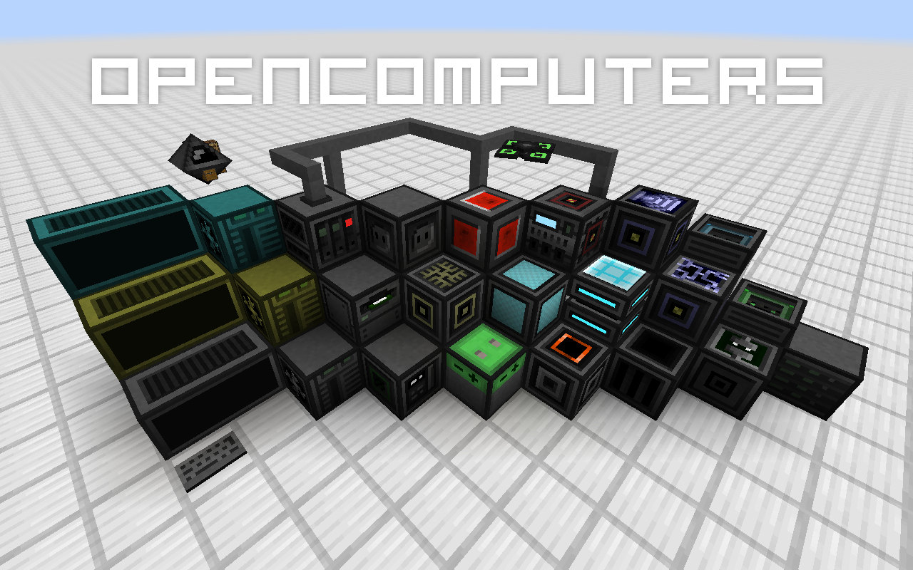

OpenComputers is a Minecraft mod that adds programmable computers and robots to the game. The built-in computer implementation uses Lua 5.2 and is fully persistent. This means programs will continue running across reloads. For more information, please [see the wiki][wiki]. Feel invited to visit the [community forums][forums] or drop by in the [IRC channel #oc on esper.net][irc].

A few useful links:
* [Minecraft Forum Thread][mcf]
* [Downloads][releases]
* [Bug Tracker][issues]
* [Wiki][wiki]
* [Ingame Manual][ingame manual]
* [IRC][irc]
* [Community Forums][forums]

### Experimental Builds
You can find experimental builds [on the build server][github-actions]. Expect these to be generally more unstable than builds marked as releases. Use these **at your own risk**, but - when using the latest one - please *do* report bugs you encounter using them. Thanks!

## License / Use in Modpacks
This mod is [licensed under the **MIT license**](https://github.com/MightyPirates/OpenComputers/blob/master-MC1.7.10/LICENSE). All **assets are public domain**, unless otherwise stated; all are free to be distributed as long as the license / source credits are kept. This means you can use this mod in any mod pack **as you please**. I'd be happy to hear about you using it, though, just out of curiosity.

## Contributing
### Assets and Localizations
1. **Translations**  
   Translations to other languages are very much appreciated. You can find the localization files [in this folder][localizations]. If a localization you wanted to create already exists, please take the time to see if the present one is complete - the strings change every so often, invalidating some of the translations. If you start a fresh localization, please base it off of the English or German one, those are the 'master' localization files. If you add a new language, please also add it to [the pack.mcmeta][pack.mcmeta] file. Keep it sorted alphabetically, use the name and region Minecraft itself uses. If you don't know how to do that, that's OK, I'll do it later.
2. **Textures**  
   If you would like to contribute better textures for certain items or blocks, feel free to pull-request them. If you would like to contribute *alternative* textures, make it a resource pack, and post it on the forums, for example.
3. **Documentation**  
   Help with keeping the [wiki][] up to date would be *really* appreciated. If you notice anything amiss and know better, fix it. If you don't ask someone who does, then fix it. If you had a question answered, consider adding that information somewhere in the wiki where you would have expected to find that information.  
   There are also the files containing the ingame help [for programs][manpages] and [for blocks and items][manual], which could probably be much better than they are right now. Improvements to them, and new ones (e.g. for the libraries, such as `text` or `sides`) would help a lot. Thanks!
4. **Robot Names**  
   Robots get a random name when placed (unless set with an Anvil). The list the names are chose from [can be found here][robot names]. Feel free to pull request additional names! *However*: since the list has grown to a considerable length already, here are the two basic criteria for new names: it must either be a real or fictional robot, or an AI that at least *appears* to be self-aware.

### Bug fixes, features and scripts
1. **Bugs**  
   If you've found a bug, please report it in the [issue tracker][issues], after checking it has not been reported before - and possibly even fixed by now. If you think you can and have fixed it, feel free to do a pull request, I'll happily pull it if it looks all right to me - otherwise I'll gladly tell you what to change to get it merged.
2. **Features**  
   If you'd like to propose a new feature, take it to the [forums][] or the [issue tracker][issues]. If you'd like to contribute code that adds new features, please make sure to discuss the feature with me, first - again, the issue tracker is an OK place for this, there are a couple of feature requests there, already. Alternatively start a topic on the forums to discuss the feature, and / or stop by the [IRC][irc] to talk about it. Blind / unexpected feature pull requests might very well not make it, so save yourself some time by talking about it, first! Thanks.
3. **Scripts / Programs**  
   OpenComputers generates floppy disks in dungeon chests that can contain data from a selection of 'loot' directories. For example, the IRC client and OPPM (a package manager) are two programs that can be found on such loot disks. If you'd like to contribute a program that can be found this way, please have a look at [the loot readme][loot], which explains how to add custom loot. Simply pull request your loot!
4. **Core Scripts**  
   If you would like to contribute scripts to the "core" Lua code (which basically defines 'OpenOS'), please have a look at the [code conventions][] for Lua to save us all some time. Bug fixes are always welcome. Additional programs and features should be kept small. Bigger programs (rule of thumb: larger than 3KiB) should go onto loot disks.
5. **Drivers**  
   As of OC 1.4, mod interaction that was previously provided by OpenComponents is now fully integrated into OC itself. If you wish to contribute a driver for blocks from other mods, cool! Have a look at the [integration][] package to get an idea of how to structure modules and read the readme in that package for more information (in particular on additional criteria to get your PR merged).

#### Pull requests
The following are a few quick guidelines on pull requests. That is to say they are not necessarily *rules*, so there may be exceptions and all that. Just try to stick to those points as a baseline.
- Make sure your code is formatted properly.
- Make sure it builds and works.
- Try to keep your changes as minimal as possible. In particular, no whitespace changes in existing files, please.
- Feel free to code in Java, but don't be surprised if I convert it to Scala later on, if I feel it makes the code more concise ;-)
- When adding mod dependencies, keep them *weak*, i.e. make sure OC still works without that mod. Also, prefer adding a Gradle dependency over adding API class files to the repo.
- [Squash](http://gitready.com/advanced/2009/02/10/squashing-commits-with-rebase.html) your commits!

Also, and this should go without saying, your contributed code will also fall under OC's license, unless otherwise specified (in the super rare case of adding third-party stuff, add the according license information as a `LICENSE-???` file, please).

## Extending
### In your own mod
To use [the API][api] in your own mod, either get the API JAR from the [build server][github-actions], or if you're using [Gradle](http://gradle.org/), add a dependency to the maven repo:
```groovy
repositories {
    maven { url = "http://maven.cil.li/" }
}
dependencies {
    compile "li.cil.oc:OpenComputers:MC1.7.10-1.5.+:api"
}
```
Adjust the version number accordingly to the version you'd like to build against.

To run the mod in your development environment, download the [`dev` JAR from the build server][dev-jar] and drop it into your development environment's `eclipse/mods` (Eclipse) or `run/mods` (IntelliJ IDEA) folder.

Alternatively, leave out the `api` classifier and you can build against the dev JAR directly. This way you don't have to add it to your mods folder, but you will have to add `-Dfml.coreMods.load=li.cil.oc.common.launch.TransformerLoader` to the VM options in your run configuration.

If you have any questions, please do not hesitate to ask, either in the [forums][] or in the [IRC][irc]!

### OpenComputers
Want to tinker with the mod itself? Here is how - for IntelliJ IDEA users.

**Important**
- Make sure you have the Gradle plugin enabled in IntelliJ IDEA (File->Settings->Plugins).
- Make sure you have the Scala plugin enabled.

Clone the repository, then in it run  
`gradlew setupDecompWorkspace`  
to setup the workspace, including assets and such, then  
`gradlew idea`  
to create an IntelliJ IDEA project.

Open the project and you will be asked to *import the Gradle project* (check your Event Log if you missed the pop-up). **Do so**. This will configure additionally referenced libraries.

For more specific instructions, read [Steps to run master MC1.7.10 from IDEA][idea_1.7.10]

In the case you wish to use Eclipse rather than IntelliJ IDEA, the process is mostly the same, except you must run `gradlew eclipse` rather than `gradlew idea`.


[api]: https://github.com/MightyPirates/OpenComputers/tree/master-MC1.7.10/src/main/java/li/cil/oc/api
[code conventions]: https://ocdoc.cil.li/lua_conventions
[dev-jar]: https://ci.cil.li/view/OpenComputers/job/OpenComputers-MC1.7.10/
[forums]: https://oc.cil.li/
[github-actions]: https://github.com/MightyPirates/OpenComputers/actions
[irc]: http://webchat.esper.net/?channels=#oc
[issues]: https://github.com/MightyPirates/OpenComputers/issues?state=open
[localizations]: https://github.com/MightyPirates/OpenComputers/tree/master-MC1.7.10/src/main/resources/assets/opencomputers/lang
[loot]: https://github.com/MightyPirates/OpenComputers/tree/master-MC1.7.10/src/main/resources/assets/opencomputers/loot
[manpages]: https://github.com/MightyPirates/OpenComputers/tree/master-MC1.7.10/src/main/resources/assets/opencomputers/loot/OpenOS/usr/man
[manual]: https://github.com/MightyPirates/OpenComputers/tree/master-MC1.7.10/src/main/resources/assets/opencomputers/doc
[mcf]: http://www.minecraftforum.net/topic/2201440-opencomputers-v122/
[pack.mcmeta]: https://github.com/MightyPirates/OpenComputers/blob/master-MC1.7.10/src/main/resources/pack.mcmeta
[releases]: https://github.com/MightyPirates/OpenComputers/releases
[robot names]: https://github.com/MightyPirates/OpenComputers/blob/master-MC1.7.10/src/main/resources/assets/opencomputers/robot.names
[wiki]: https://ocdoc.cil.li/
[integration]: https://github.com/MightyPirates/OpenComputers/tree/master-MC1.7.10/src/main/scala/li/cil/oc/integration
[ingame manual]: https://github.com/MightyPirates/OpenComputers/tree/master-MC1.7.10/src/main/resources/assets/opencomputers/doc
[idea_1.7.10]: https://ocdoc.cil.li/tutorial:debug_1.7.10
